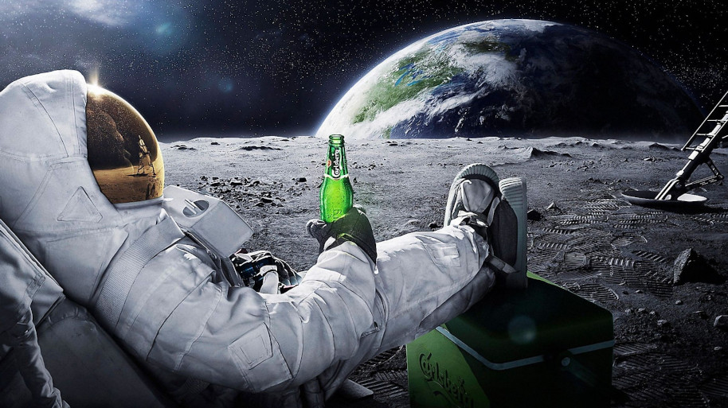

# Alcoholic Astronomers

Bringing you star gazing tranquility one drink at a time.

## What is it?

`aa` will strip PLI protection from IP created by VCS 6.

## Why?

Because it was dead simple! And I was really curious about what's in these new Verilog files I gained access to yesterday... :)

## Etymology

Someone who likes cocktails and planets.
